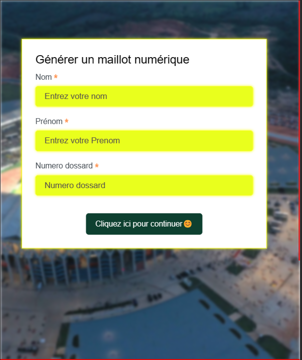
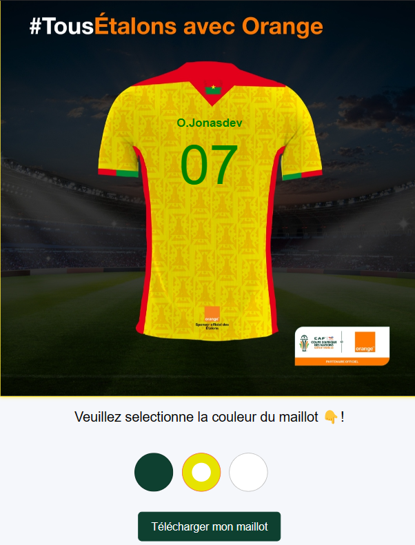
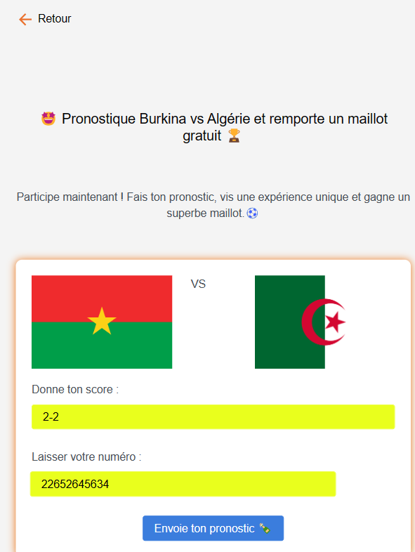

## CHALLENGE ODC CAN 2024

 

## Live Demo

Découvrez la démo en direct [ici](https://can.pteam-transfert.com/)

## Description
Ce projet a été réalisé dans le cadre du challenge Orange Digital Center (ODC) pour la CAN 2024, organisée en Côte d'Ivoire. L'objectif était de concevoir une plateforme interactive dédiée aux fans, offrant trois principales fonctionnalités :
    
1. Page d'Accueil avec Formulaire :
    - Les utilisateurs peuvent accéder à une page d'accueil conviviale comprenant un formulaire intuitif.
    - En fournissant le nom, prenom, et le numero de dossard qu'il souhaite

2. Page de Choix du Maillot et le téléchargement du maillot:
    - Une page dédiée permet aux utilisateurs de choisir et télécharger le maillot de leur équipe favorite.

    - Les couleurs disponibles sont le Blanc, Vert et Jaune
        

3. Page de Pronostic :
    - Les utilisateurs ont la possibilité de partager leurs pronostics pour les matchs à venir.

    - Image illustration 
        

## Comment installer le projet?

`1er etape: Cloner le Repository`

    git clone https://github.com/jonasdevpro/MaCan.git

`2eme etape: Télécharger les Packages Vendor :`

    composer install

`3 etape: Copier le fichier .env :`

    cp .env.example .env

`4 etape : Générer la Clé API dans .env :`

    php artisan key:generate

`5 etape: Lancer le Serveur :`

    php artisan serve

`6 etape: Effectuer la Migration avec les Factories :`

    php artisan migrate --seed

## Accès à la Partie Admin :

Veuillez accéder à votre base de données, plus précisément à la table "Administrateurs", pour obtenir les accès générés grâce à la factory.
    
Pour accéder au chemin de connexion de l'administrateur, veuillez cliquer sur JK.S 👇

Explorez la plateforme et profitez de l'expérience immersive dédiée à la CAN 2024!

## Auteur

[Jonasdev](https://www.linkedin.com/in/jonas-so-784515274) - Développeur Full Stack 

Pour toute question ou assistance, veuillez:
[Contactez-moi sur WhatsApp](https://wa.me/+22652645634)

##

